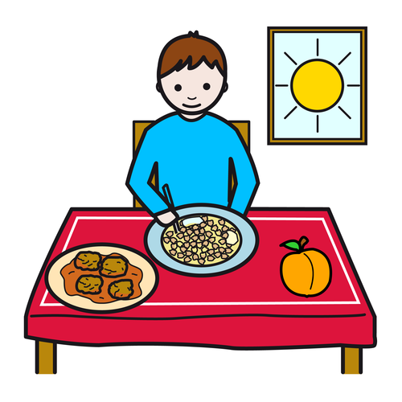

# A los alimentos

 

**La alergia a los alimentos es** una reacción adversa a un alimento que es bien tolerado por la mayoría de las personas, y se reproduce si vuelve a haber un contacto con ese alimento.

Es importante que **diferencies la alergia a un alimento que la intolerancia (al gluten, a la lactosa),** ya que no significa lo mismo.

Los **alimentos más frecuentes** en la alergia alimentaria depende de la edad del niño, así:

*   **Niños pequeños:** huevos y leche, seguidos del pescado
*   **Niños mayores:** marisco, legumbres, frutos secos...

Es importante que sepas que los **síntomas** que puede tener un **niño alérgico a un alimento si lo come accidentalmente** son:

*   Piel: urticaria, habones, picor...
*   Digestivos: vómitos, diarrea
*   respiratorios: asma, rinitis
*   En todo el cuerpo, al mismo tiempo: anafilaxia

### **Tratamiento**

*   Como puedes imaginar, el mejor es evitar el alimento que produce la alergia, por lo que es muy importante leer los etiquetados de muchos alimentos elaborados, por si aparece oculto.
*   El médico habrá puesto en la Ficha del escolar con asma, o documento similar, qué es lo que hay que hacer en estos casos, de ahí la importancia de mantener una comunicación fluida entre los padres, el peronal sanitario y el centro escolar.

Es importante que sepas que según la **"Guía de comedores escolares de la Comunidad Autónoma de Aragón"** se hace mención a la situación de un niño que puede presentar una alergia alimentaria, por lo que es aconsejable que la veas, ya que ha sido presentada en el año 2013.

El niño con alergia a los alimentos no debería ser tratado de forma diferente al resto de niños de la clase al asistir a celebraciones, excursiones o campamentos de verano. 

Para ello es fundamental que tu entusiasmo al hacer este curso se transmita a los compañeros de tu centro y favorecer así su integración.

## Importante

*   Las reacciones pueden ocurrir en el aula, el patio, o el comedor escolar
*   Los síntomas iniciales pueden ser leves y son difíciles de interpretar
*   No es posible predecir la gravedad final de las reacciones por los síntomas iniciales
*   Todo el personal escolar debe recibir formación sobre el reconocimiento y el tratamiento precoz de las reacciones alérgicas para que se pueda administrar la medicación de urgencia sin retraso.
*   El riesgo de anafilaxia por contacto cutáneo con el alérgeno alimentario es mínimo
*   Por tanto, no es necesario separar a los niños de sus compañeros durante la comidas, aunque se debe evitar el compartir o intercambiar comida

