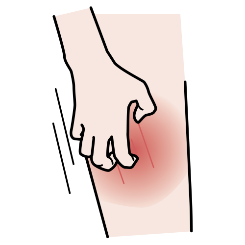
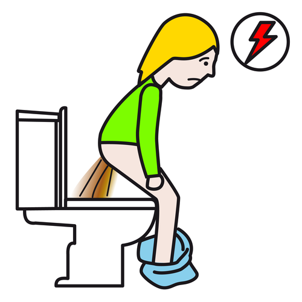
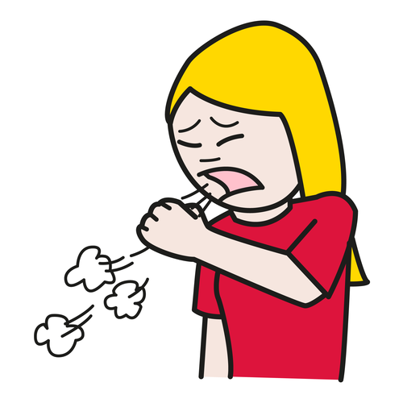

# Alergias

 Fig.3.4. Picor, vomitar, diarrea y toser. Sergio Palao. ARASAAC. CC (BY-NC-SA)

### **Qué es la alergia**

**La alergia es** una reacción de sensibilidad elevada del organismo que lucha por defenderse de una sustancia extraña o **alérgeno,** por lo tanto, el origen de una reacción alérgica está en la persona, ya que esos alérgenos no producen una respuesta defensiva en la mayoría de los individuos. 

**La reacción alérgica** se produce cuando ciertos estímulos como un alimento, un medicamento, una picadura de un insecto... actúan sobre una persona que está predispuesta. 

Los **síntomas** en la mayoría de las ocasiones tardan muy poco tiempo en aparecer y suelen afectar a distintas partes del cuerpo, tal y como puedes ver en el esquema.

 

 Fig.3.5. Esquema interacción proceso alérgico

Así, se puede desencadenar:

*   **Urticaria:** es la aparición súbita de piel enrojecida y sobreelevada (los típicos habones y ronchas) que pican y cambian de localización en el cuerpo
*   **Angioedema**: se llama así al hinchazón en la zona de la cara, los genitales, las manos o pies... que no pica ni duele (es una sensación de quemazón) que también se puede dar en la boca, faringe...
*   **Anafilaxia**: es una reacción inmediata y muy grave a nivel de todo el cuerpo
*   **Mordedura** de animales/insectos: puede producir reacciones locales

