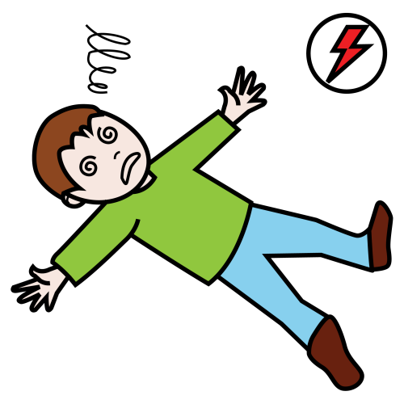

# Convulsiones

 

 Fig.1.5. Desmayo. Sergio Palao. ARASAAC. CC (BY-NC-SA)

Una **crisis convulsiva** es un trastorno de la comunicación eléctrica entre las neuronas.

Como consecuencia, se producen **comportamientos diferentes,** tales como;

*   Contracciones musculares repentinas
*   Una caída súbita
*   Trastornos de la visión

**Se producen por varias causas**, siendo las más frecuentes en general:

*   Suspensión de fármacos anticonvulsionantes
*   Abstinencia de alcohol
*   Enfermedad Vascular Cerebral
*   Metabólicas (bajada de glucosa en sangre, infecciones)
*   Traumatismos
*   Toxicidad por fármacos o drogas
*   Infección del Sistema nervioso central
*   Tumor
*   Lesión congénita
*   En los **niños,** particularmente, podemos encontrar además:
    *   Fiebre
    *   Epilepsia 

## Importante

*   No todos los alumnos que tienen una convulsión tienen epilepsia
*   Si aparecen en una situación específica (estrés emocional...) no suele tratarse de una crisis convulsiva
*   Si los movimientos que hace el niño ceden con una maniobra de tipo mecánico cuando te acercas a él, tampoco suele ser una convulsión

 **Los síntomas y signos más comunes que ocasionan son:**

*   Gemido repentino
*   Caída al suelo
*   Rigidez
*   Respiración poco profunda
*   Espasmos musculares (contracciones involuntarias de los músculos)
*   Perdida del conocimiento 

**Lo que tienes que hacer es:**

*   Hay que prevenir una caída dejando a la persona en el suelo en un área segura libre de muebles u otros objetos puntiagudos.
*   Dejar descansar la cabeza de la persona. No sujetarla.
*   Aflojar la ropa ceñida, especialmente alrededor del cuello.
*   Se debe voltear a la persona de lado en caso de presentarse vómito. Esto impide que dicho vómito sea inhalado hacia los pulmones: es la Posición Lateral de Seguridad, que sabrás realizarla en el Módulo 2)
*   Permanecer con la persona hasta que llegue la ayuda y mientras tanto vigilar sus signos vitales (pulso, frecuencia respiratoria).
*   (En el Módulo 3, al hablar de la Epilepsia unirás estos conocimientos adquiridos)

**Lo que no es recomendable que hagas es:**

*   Levantar o sujetar al niño con una convulsión
    
*   Ofrecerle bebidas de cualquier tipo (con azúcar, gas...)
    
*   Introducirle objetos en la boca
    

## Importante

Actuación inicial: cuando se presenta una convulsión, el objetivo principal es proteger a la persona de una lesión.

