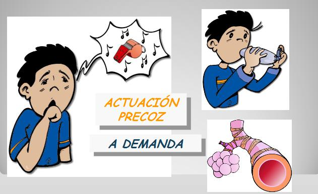

# Crisis de asma: ¡actúa!

 

La crisis supone un **empeoramiento** progresivo o repentino de los síntomas, y **se puede producir por 3 causas** fundamentalmente:

*   Si hay contacto con un factor desencadenante
*   No llevar el tratamiento indicado
*   No realizar la técnica de inhalación bien.

Por eso, **debes conocer** qué síntomas indican que está empezando una crisis de asma, ¡**es importante!: sibilancias, tos, fatiga y dificultad para respirar.**

**Además debes:**

*   Transmitir y mantener la calma, para que tu alumno se tranquilice
*   Situarlo en un lugar tranquilo y con aire limpio
*   Hacer que adopte una posición cómoda, preferiblemente sentado y ligeramente reclinado
*   Indicar que se relaje y realice respiración diafragmática, que consiste en inhalar lenta y profundamente a través de la nariz, empujando el abdomen hacia fuera, y a continuación exhalar lenta y profundamente a través de la boca. Mientras se exhala, dejar que el vientre se relaje.
*   Evitar que hable si no es necesario.

Es fundamental **tratar los síntomas tan pronto como sea posible**: para ello supervisaremos las instrucciones escritas en la **"Ficha del niño con asma"** (que puedes ver en los recursos, ya que es la última actualización, en octubre de 2013) .

Es conveniente administrar **de 2 a 4 inhalaciones del fármaco de rescate cada 20 minutos en la primera hora,** siendo recomendable seguir las instrucciones de la ficha para saber **a quién tienes que llamar** siempre que ocurra una crisis, y más si no mejora a los 20 minutos. De forma habitual el niño mayor sabe administrarse la medicación, aunque es conveniente tu supervisión.

**Signos que advierten de una crisis grave:** hay que solicitar **asistencia sanitaria urgente llamando al 112:**

*   Color azulado en labios o uñas
*   Movimiento de las alas de la nariz al respirar
*   Hundimiento del pecho al respirar
*   Dificultad para hablar, andar o disminución del nivel de conciencia...

 Te recomendamos veas los **materiales multimedia**

