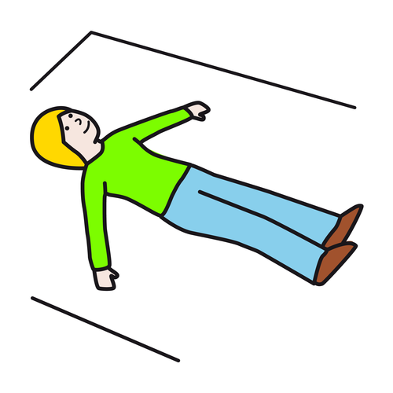

# Crisis epilépticas

 

Una vez que conoces qué son, queremos que comprendas los siguientes detalles importantes.

### **¿Por qué se produce?**

Como sabes, las neuronas se comunican entre sí mediante "impulsos o descargas eléctricas": en una crisis, un grupo de neuronas descarga impulsos de forma excesiva, debido a un desencadenante ya conocido (una bajada de azúcar, la toma de alcohol...) y tiende a no repetirse.

En otras ocasiones, no se conoce el desencadenante, aparece de forma espontánea, y tiende a repetirse: por eso ahora verás que para que una persona tenga epilepsia, se precisa que la crisis sea espontánea y se repita.

### **¿Qué factores pueden predisponer a tener una crisis?**

*   Olvido o abandono de la medicación
*   Tomar alcohol (y otras drogas), así como otros excitantes en mucho exceso.
*   Falta de sueño, o alteración en el ritmo regular del mismo, que hace no descansar lo suficiente (si por alguna causa ocurre, hay que compensar, por ejemplo, con una siesta).
*   Tensión excesiva y fatiga física
*   Tener fiebre

*Hay un tipo de epilepsias que se llaman "fotosensibles" y son el 2% de todas, en las que puede desencadenar la crisis por demasiada estimulación sensorial, por eso se recomienda alejarse de las luces intermitentes en las discotecas, ver la televisión a cierta distancia... pero son muy raras. **Como curiosidad**, te invitamos a que veas el videoclip de Kanye West, Rihanna y Kid Cudi "All Of The Lights", en el que se tuvo que incluir al inicio una advertencia en relación al peligro se sufrir una crisis por los cambios buscos repetitivos de los colores. De paso, haces un mini descanso de 5 minutos

### **Tipos de crisis epilépticas**

Hay dos tipos fundamentales

**1 Crisis parciales o focales:** se implica sólo una parte del cerebro, es decir, la descarga eléctrica comienza en una parte de la superficie cerebral.

https://youtu.be/RxoshLNnZ60

**Síntomas más comunes de una crisis parcial:**

*   Mirada perdida
*   Movimientos torpes
*   Masticación
*   Habla confuso
*   Temblores

**2 Crisis generalizadas:** la descarga eléctrica afecta a toda la superficie del cerebro al mismo tiempo, y supone una pérdida de consciencia. Sin duda, **las más frecuentes en el niño.** Existen también varios tipos.

**Síntomas más comunes de una crisis generalizada**

*   Pérdida del conocimiento
*   Contracción o relajación repentina muscular
*   Convulsiones

El llamado **"foco epiléptico"** es la zona de las neuronas irritadas donde se inicia la descarga y da comienzo a una crisis focal, que puede extenderse a una generalizada: por eso, a veces es difícil poder hacer la clasificación, y se llaman **crisis indeterminadas. **

## Importante

*   Las crisis epilépticas son la manifestación de la epilepsia
*   Se deben a una excesiva actividad eléctrica en un grupo de neuronas
*   Existen numerosos factores que pueden ayudar a desencadenar una crisis
*   Las crisis focales pueden acompañarse o no de pérdida de conocimiento
*   En las crisis parciales es típico: mirada perdida, caminar sin rumbo, masticar, hablar confuso, temblores, movimientos torpes
*   Las crisis generalizadas se acompañan de pérdida de conocimiento, y además: convulsiones, contracción o relajación de la musculatura

