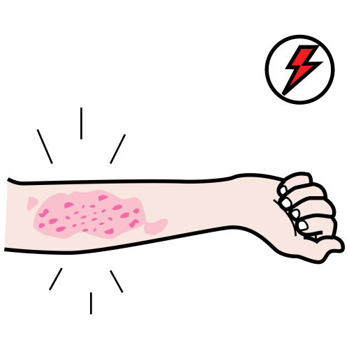

# Eccema

 

 Fig.3.6. Eccema. Sergio Palao. ARASAAC. CC (BY-NC-SA)

**Es una alteración crónica inflamatori****a de la piel, **frecuente en los niños escolares.

Los **síntomas** son el picor y la excoriación y se produce generalmente por **alérgenos** de tipo:

*   Alimentarios (p. ej. huevo)
*   Inhalantes (p. ej. ácaros del polvo, caspa de gato) 

No debes asustarte, ya que el **tratamiento** es muy sencillo: 

*   Hidratante tópico
*   Anti-inflamatorio tópico
*   Evita los factores desencadenantes específicos e inespecíficos

**Los retos para la escuela,** y ante los que debes estar alerta y preparado, **son los siguientes:**

*   Los efectos físicos, psicológicos y sociales están subestimados.
*   No tienen importancia las situaciones urgentes.
*   Los síntomas como el picor interfieren con la concentración durante el día y con el sueño, llevando a cansancio y cambios de humor, empeorando así la actividad diurna.
*   Las burlas, la vergüenza y el abuso causan aislamiento social y pueden llevar a absentismo escolar.
*   El estrés por los exámenes puede empeorar el eccema.

**Los niños con eccema necesitan** aplicación frecuente de **tratamientos tópicos** durante las jornadas escolares para prevenir la sequedad de piel y el subsiguiente rascado e infección.

## Importante1

### **¿ Qué puntos de actuación tienes en la escuela ?**

1.  Proporcionar formación sobre el eccema para los miembros adecuados del personal.
2.  Asegurarse de que se llevan a cabo las medidas de evitación de factores desencadenantes específicos.
3.  Permitir que los niños se apliquen el tratamiento tópico del eccema en cualquier momento durante la jornada escolar. (Se tendría que permitir también que los miembros del personal apliquen tratamientos tópicos a los niños pequeños con la frecuencia recomendada por los padres o el médico del niño).
4.  Asegurarse que se permite que los estudiantes usen alternativas al rascado, tales como compresas frías, en cualquier momento (incluso durante los exámenes)
5.  Con permiso previo, el profesor puede hablar del eccema como un tema escolar, a fin de desterrar mitos sobre el eccema (p. ej. que es contagioso) y reducir la vergüenza y las burlas
6.  Permitir que los niños interrumpan o disminuyan temporalmente la exposición a piscinas en casos especiales, y que puedan ducharse y volver a aplicarse crema después de educación física.

