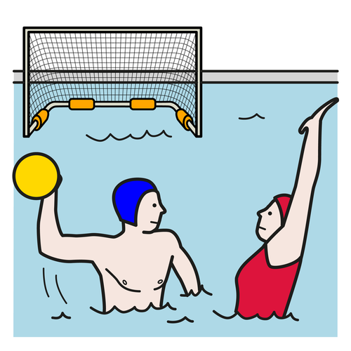

# Ejercicio físico

 Fig.3.26. Jugar al waterpolo. Sergio Palao. ARASAAC. Licencia CC BY-NC-SA

Probablemente te preguntes si tu alumno con diabetes puede hacer participar en una competición deportiva o practicar el mismo ejercicio que el resto de sus compañeros. Tienes que saber que **la diabetes no supone impedimento para realizar ejercicio físico o deporte.**

**El ejercicio disminuye la glucemia** porque el músculo consume glucosa para conseguir energía. El niño que tiene diabetes puede hacer el mismo ejercicio que el resto de sus compañeros, así como participar en todas las actividades y competiciones con las debidas **precauciones**:

**Antes:** conviene realizar un control de glucemia y en dependencia del resultado actuar. Los padres habrán aportado documentación en la que se detallan 3 situaciones: que la glucemia esté en límites aceptados como normales, que esté muy alta, o muy baja. Ver PDF.

Si está en los **límites aceptables,** tomará una cantidad extra de hidratos de carbono.

Si está **excesivamente baja** (normalmente por debajo de 75 mg/dL), tomará una cantidad extra de hidratos de carbono y no realizará ejercicio físico hasta que la glucemia se normalice.

Si está **excesivamente alta** (normalmente por encima de 250 mg/dL)) no hacer ejercicio físico.

**Durante o después de un ejercicio extraordinario:** es conveniente realizar otro control glucémico para valorar el nivel de glucemia y actuar según sus resultados; lo habitual es que después del ejercicio haya que disminuir la insulina y aumentar la ingesta de hidratos de carbono. Los padres nos indicarán también qué alimentos suplementarios deben tomar en estas situaciones

## Importante

El ejercicio físico baja la glucosa de la sangre, por lo que hay que tener las debidas precauciones para evitar un descenso rápido de la misma

