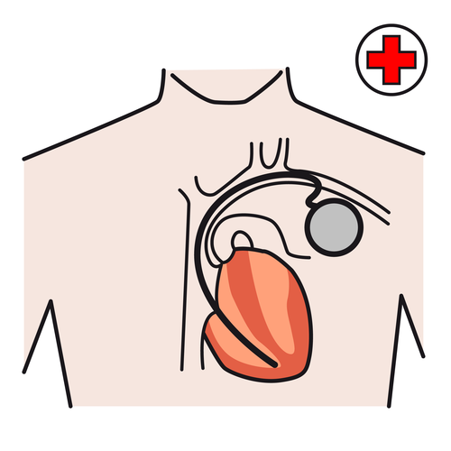

# El tratamiento

 Fig.3.20. Marcapasos. Sergio Palao. ARASAAC. Licencia CC. BY-NC-SA

**1\. Medicinas**

Puede ocurrir que nuestro joven amigo cardiópata tenga que tomar una medicación que coincida con el horario del colegio, por lo que los padres os habrán proporcionado una información del cardiólogo para que tengáis conocimiento.

** Las medicinas que pueden tomar son, principalmente, 2:**

*   **Diuréticos:** ayudan en la eliminación de líquidos por el riñón. Como **el niño va a tener necesidad de ir más frecuentemente al servicio para orinar,** debes saber que es debido a la acción de este fármaco, para que puedas atender correctamente las peticiones que en este sentido te pida tu alumno.
    
*   **Anticoagulantes:** sirven para que la sangre no produzca coágulos, y por esta razón **no son recomendables los deportes de contacto.**
    

**2\. Operaciones quirúrgicas**

Por los numerosos tipos de cardiopatías, **las más graves deben intervenirse quirúrgicamente** antes de iniciar la escolarización. Otras operaciones se llevan a cabo a lo largo de varios años, lo que favorece el absentismo escolar.

**Al incorporarse a clase tras la hospitalización** le costará mantener la misma concentración que tenía antes de su ingreso; esta situación mejora poco a poco hasta llegar al ritmo general que lleva la clase.

Recuerda que para este niño tú eres alguien de quien se siente orgulloso, por lo que debes tratar este tema con normalidad, ya que las operaciones dejan cicatrices en la piel, que aunque están cerradas y curadas, pueden ser objeto de miedo y vergüenza ante los amigos de la clase.

