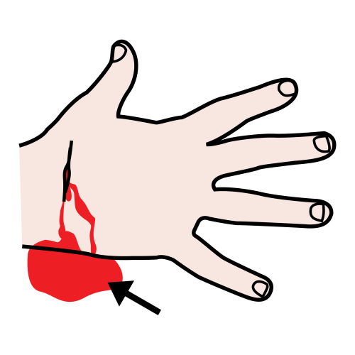

# Heridas

 

La **herida** es una pérdida de continuidad en la piel, "solución de continuidad", que posibilita la entrada de microorganismos en el cuerpo, con el consiguiente riesgo de infección. Esta infección puede ser superficial, o extendese a zonas más profundas, lo que supone una complicación que debemos prevenir.

Existen **muchas clasificaciones** de las heridas: superficiales y profundas, simples y complicadas (por mordedura humana/de animales, con cuerpos extraños, infectadas...), según la causa que las produce (contusas, punzantes, contusas, laceraciones, amputaciones...).

**Se producen por varias** causas, siendo las más frecuentes:

*   Traumatismos, golpes
    
*   Cortes por un cuchillo, lata, vidrio
    

**Los síntomas y signos que ocasionan son:**

*   Dependen la causa que las originen, extensión, suciedad, profundidad, posibilidad de infección...
    
*   En general, tienes que saber que habrá:
    
    *   Rotura de la piel
        
    *   Dolor más o menos intenso
        
    *   Hemorragia
        

**Lo que tienes que hacer es:**

*   Retira todo lo que te pueda significar un obstáculo en tu actuación, para que veas bien la herida (ropas, pulseras...)
    
*   Lávate las manos con agua y jabón
    
*   Ponte guantes
    
*   Limpia la herida con suero fisiológico a chorro, o con agua y jabón. Intenta hacerlo desde el centro de la herida hacia afuera, para expulsar la suciedad y posibles cuerpos extraños.
    
*   Utiliza gasas estériles para secar la herida, sin presionar sobre ella, sino en forma de "toques" desde dentro de la herida hacia fuera
    
*   Aplica el desinfectante en la gasa estéril y aplícalo sobre la herida, en dirección de dentro hacia fuera
    
*   Déjalo secar, comprobando si hay o no hemorragia.
    
    *   Si sangra, presiona con una gasa estéril hasta que deje de sangrar
        
*   Si la herida es importante y sangra:
    
    *   No intentes hacer todo el proceso para curarla: haz presión sobre la herida comprimiendo con las gasas estériles
        
    *   Si es en la extremidad inferior, elévale el miembro
        
    *   Solicita ayuda, llama al 112
        
*   Informa a los padres de lo que ha ocurrido
    

**Lo que no es recomendable que hagas es:**

*   Utlizar algodón, alcohol, agua oxigenada
    
*   Aplicar medicamentos tipo pomada, polvos, etc
    
*   Extraer un cuerpo extraño que esté clavado, ya que hace de tapón de una posible hemorragia, y se puede producir un desgarro
    

