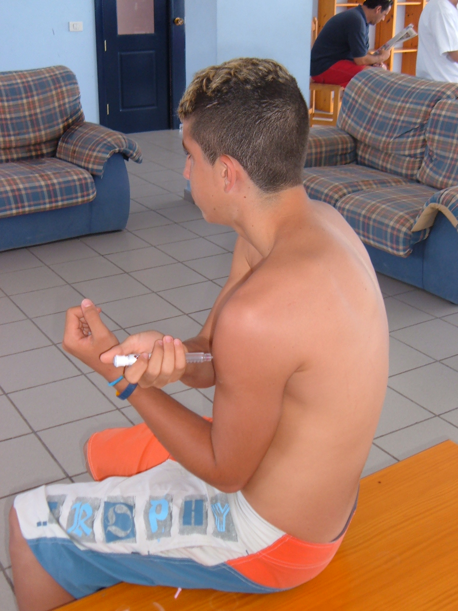

# Hiperglucemia

 

Como sabes, la glucemia es la glucosa de la sangre, por eso la hiperglucemia es el **aumento de la glucosa en la sangre**.

Las **causas** más habituales que la producen son:

*   Recibir menos insulina de la necesaria.
*   Haber ingerido más hidratos de carbono de los adecuados.
*   Tener una enfermedad infecciosa.

Puedes intuir que el niño tiene hiperglucemia con unos **síntomas** que son los más frecuentes: sed intensa, necesidad de orinar con más frecuencia y cansancio. También puede aparecer: dolor de cabeza o abdominal, vómitos, “calambres” en las piernas.

### **¿Qué puedes hacer?**

Existen unas **normas de actuación** ante esta situación que **no es una urgencia**.

Podemos encontrarnos ante dos supuestos:

1.  Si tras realizar un control de glucemia se detectan **cifras por encima de los valores normales**puede ser necesario administrar una dosis de insulina suplementaria según la pauta que pueden aportar los padres.
2.  Si aparecen los síntomas antes mencionados (sed intensa, necesidad de orinar con más frecuencia, cansancio, dolor de cabeza o abdominal, vómitos, “calambres” en las piernas… ) se debe contactar con los padres y/o profesionales sanitarios responsables del escolar

## Importante

*   En muchas ocasiones un aliento con “olor a manzana” suele indicar la presencia de acetona como complicación de la hiperglucemia: es el “aliento cetósico”.
*   Cansancio, mucha sed y muchas idas al servicio para orinar es típico de una hiperglucemia

