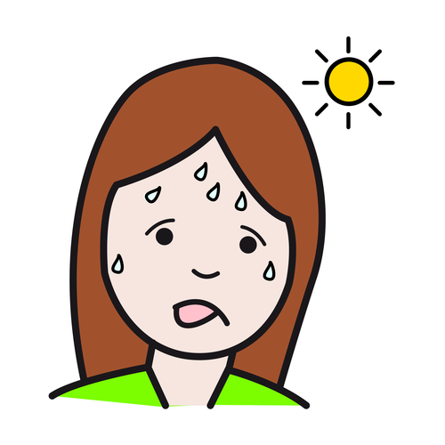

# Hipertermia, insolación

 

 Fig.1.9. Sofocos. Sergio Palao. ARASAAC. CC (BY-NC-SA)

Se deben a la alteración de la temperatura corporal

**Hay personas con mayor riesgo:**

*   Niños y adolescentes.
*   Ancianos.
*   Obesos.
*   Embarazadas.
*   Pacientes con enfermedades crónicas.

**Los síntomas y signos** que pueden aparecer son:

CALAMBRES POR CALOR:

*   Calambres y dolor muscular tras un ejercicio intenso.

AGOTAMIENTO POR CALOR:

*   Fatiga.
*   Dolor de cabeza.
*   Náuseas.
*   Sudoración.
*   Aumento de la frecuencia cardíaca.
*   Disminución de la tensión arterial.
*   La temperatura puede ser normal o estar algo elevada.

GOLPE DE CALOR:

*   Mareo.
*   Síncope (lipotimia).
*   Dolor de cabeza.
*   Alteración del nivel de la consciencia: somnolencia, coma.
*   Sudoración generalizada.
*   Temperatura superior incluso a 41 ºC.
*   Alteraciones de los órganos del cuerpo.

**Qué es lo que tienes que hacer:**

Apartar al niño de la fuente de calor, y quitarle el máximo de ropa posible

CALAMBRES POR CALOR:

*   Hidratar con zumos aportando sal.
*   Estiramiento suave y relajación muscular.

AGOTAMIENTO POR CALOR:

*   Enfriamiento simple.
*   Rehidratación oral similar al cuadro anterior.
*   Mantener en lugar fresco y sombrío.

GOLPE DE CALOR:

*   Valoración médica urgente.

## Importante

No le administres ácido acetil salicílico (aspirina) de forma general al niño, ya que hay muchos casos en los que está contraindicada

**Lo que no tienes que hacer es:**

*   Dar friegas de colonia o alcohol, (aunque en muchos sitios es una costumbre arraigada)

