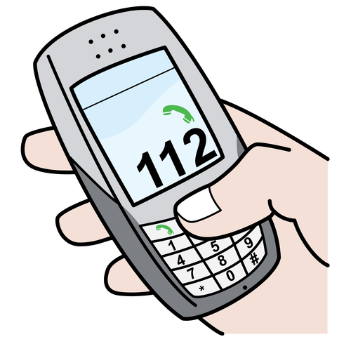

# Hipoglucemia

 Fig.3.31. Azúcar. Sergio Palao. ARASAAC. Licencia CC (BY-NC-SA) 

**Es la disminución del nivel normal de glucemia,** es decir, **una bajada brusca** del azúcar de la sangre. Las **causas más frecuentes** son:

*   Recibir más insulina de la necesaria
*   Realizar un ejercicio físico excesivo
*   Ingerir menos hidratos de carbono de los necesarios
*   Tener vómitos o diarrea intensa que impida la absorción de los alimentos

Debes estar atento, ya que los **síntomas** son variables pero cada niño suele presentar siempre los mismos. Los más frecuentes son: palidez, sudor frío, temblor, hambre, alteración del comportamiento (irritabilidad, ansiedad...). En **casos graves**, somnolencia con posibilidad de pérdida del conocimiento y convulsión.

La hipoglucemia es una **urgencia**: ¡**actuar de forma inmediata!**:

Si aparecen **síntomas de hipoglucemia o glucosa inferior a 60 mg/dL** al hacer el autoanálisis (aunque no presente síntomas), es preciso que tome azúcar, zumo de frutas u otra bebida azucarada o Glucosport® y repetir el análisis cada 10-15 minutos, repitiendo la toma (de azúcar, zumo, etc) poco a poco hasta que el nivel de glucemia se haya normalizado.

Cuando veas que el escolar esté recuperado se deben dar alimentos que contengan hidratos de carbono de absorción lenta (pan, galletas, fruta…).

 Fig.3.32. Urgencias. Sergio Palao. ARASAAC. Licencia CC (BY-NC-SA)

En los **casos más graves en los que exista pérdida de conciencia,** no se debe dar nada al escolar por boca, colocar al niño en la posición lateral de seguridad (que ya conoces del módulo 1) y es necesario **administrar Glucagón (inyectable).**

El glucagón se puede inyectar por vía subcutánea o intramuscular. **Cualquier adulto responsable (profesor o sanitario) puede administrarlo**, ya que se trata de un tratamiento urgente y eficaz pero sencillo y que no implica ningún riesgo para el joven.

Los padres facilitarán el glucagón a la escuela junto con la indicación médica para su administración. El glucagón debe guardarse refrigerado en nevera. La dosis dependerá de la edad y peso del escolar pero en general se recomienda 1/2 vial en menores de 7 años y 1 vial a partir de esta edad.

La mejor opción para resolver este problema es el glucagón, pero **si no fuera posible su administración** debe aplicarse en el interior de la boca un alimento que se absorba fácilmente sin riesgo de atragantamiento: miel, leche condensada, Glucosport® en gel…

**En los casos de hipoglucemia es preciso avisar a los padres y/o profesionales sanitarios responsables del escolar.**

Siempre es conveniente tener a mano (en el aula o cerca) el alimento que suela tomar en caso de hipoglucemia (azúcar, zumo, Glucosport®, miel…) por si el escolar no lo llevara consigo.

Los padres aportarán documentación relativa a los síntomas que suele presentar el niño cuando tiene hipoglucemia, así como dónde se encuentran los alimentos que suele tomar para su recuperación, cuáles son y en qué cantidad.

## Importante

*   La hipoglucemia siempre es una urgencia: actúa pronto
*   Si tienes duda entre una hipoglucemia o una hiperglucemia da hidratos de carbono de absorción rápida
*   Fíjate qué diferentes son los síntomas de la hipoglucemia de los de la hiperglucemia
*   El glucagón es una hormona con acción opuesta a la insulina: sube la glucosa en sangre

