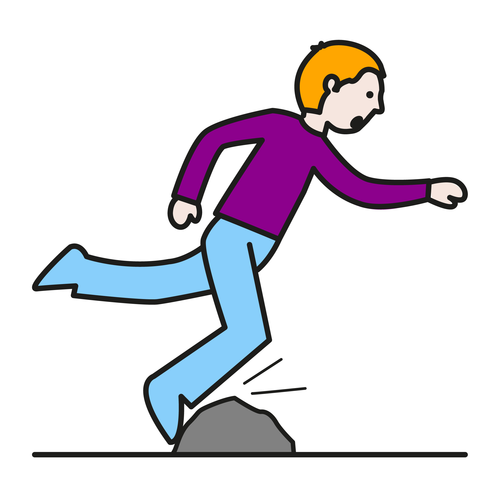

# Módulo 1. Accidentes y Primeros Auxilios

 

### Introducción

Del total de **accidentes** que ocurren en la **edad infantil,** aproximadamente el **15% ocurren en el centro educativo**, lugar donde el niño pasa mucho tiempo durante el día, y además haciendo numerosas actividades.

Como docente te habrás encontrado en numerosas situaciones en las que hayas tenido que actuar para atender a un alumno que se ha caído y se ha hecho una herida, a uno que tiene una hemorragia por la nariz, o a otro que le ha picado un insecto en una salida extraescolar, por citar algunos casos.

A través de este módulo **queremos enseñarte** de forma muy sencilla **en qué consisten los accidentes más frecuentes** que pueden ocurrir en el medio escolar, así como las **recomendaciones para que actúes** de la mejor manera.

También vamos a hablarte de **secuencias de actuación en los primeros auxilios,** como ciudadano en general que debes prestar auxilio a una persona que te necesite, y como profesor en particular, prestando este primer auxilio a un niño a quien tú, en primera instancia, puedes salvarle la vida hasta que llegue el profesional sanitario.

Al finalizar este módulo te nombraremos qué es la **"posición en espera"** de una persona que está inconsciente pero respira, con el fin de que te sirva para iniciar con ganas el próximo módulo.

Aunque se trata de un **contenido no muy extenso, es importante el dominio de los componentes,** ya que hay que memorizar algunos esquemas para saber actuar tanto fuera como en el interior de nuestro centro educativo

## Objetivos

**Al finalizar este módulo estarás capacitado para:**

*   Superar el miedo ante una situación en la que exista un accidente y tengas que actuar 
*   Saber en qué consiste, qué hay que hacer y qué no en un accidente común de un niño en el centro escolar
*   Conocer los principios básicos de los primeros auxilios
*   Realizar con éxito los primeros auxilios en el momento que se precise de tu actuación, incluidos los que se marcan, al finalizar el módulo 3, como situaciones de actuación rápida en una enfermedad crónica
*   Comprender las medidas de prevención para ti y para la persona sobre la que tienes que actuar referentes a COVID-19, para hacerlo con la mayor seguridad
