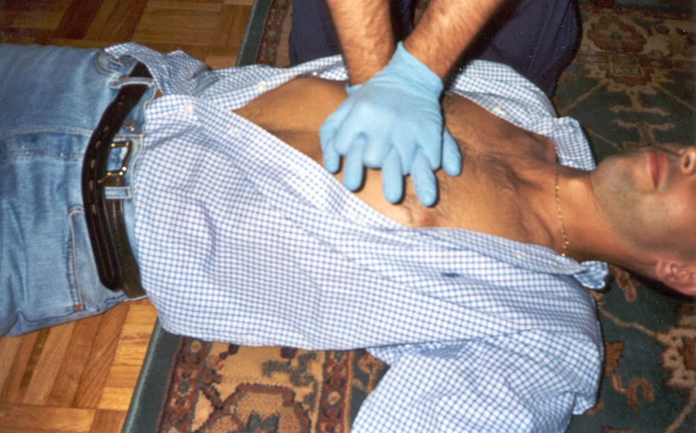

# Módulo 2. Posición Lateral de Seguridad y Reanimación Cardiopulmonar

### **Introdución**

En este módulo 2 te ayudaremos a saber realizar las maniobras más complejas, como son la **reanimación cardiopulmonar** en la persona adulta y en el niño, que a priori puedan parecerte difíciles de hacer, por el miedo y la falta de información, pero comprobarás que son sencillas de realizar, al igual que colocar a una persona tumbada en el suelo en la **Posición Lateral de Seguridad,** para que no se asfixie por atragantamiento de saliva o vómitos, de la que ya "te sonarán" algunas cosas al haberla nombrado en el Módulo 1, ¿recuerdas?

Por la **situación actual de pandemia,** la realización de **la Reanimación Cardiopulmonar tiene unas modificaciones en sus protocolos de actuación**, publicados recientemente, basadas en medidas de seguridad que evitan riesgos de infección del reanimador, garantizando la mejor atención a la víctima. 

Te ofrecemos **numeroso material, también en formato multimedia,** para que lo revises y nos plantees cuantas dudas te surjan.

Este módulo, que es el segundo del curso, es también el más divertido en el estudio y **prácticas que serán voluntarias y quedan aplazadas al momento en el que podamos realizarlas.** Seguro que opinas como nosotros al terminarlo.
