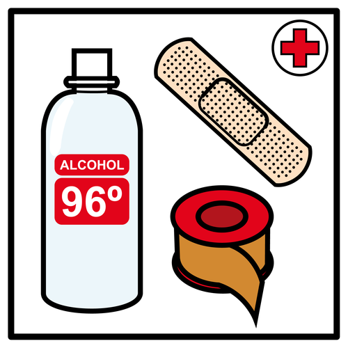

# Módulo 4. Botiquín escolar. Otras situaciones: Trastornos de Conducta Alimentaria. Obesidad. Documentos e instrucciones

### INTRODUCCIÓN

Una vez que has alcanzado el último módulo **tenemos que felicitarte**, ya que está en la recta final para finalizar este curso, que está intentando capacitarte en un primer escalón para entender las condiciones a las que se enfrenta un niño en el centro escolar, tanto de forma crónica, como en algunas situaciones que aparecen en la vida de forma aguda.

**En este módulo vas a aprender aspectos muy diversos** que, a modo de malla, tejen la base de una correcta atención al alumnado, como es el caso de tener un **botiquín escolar** en condiciones.

En otras situaciones, necesitarás conocer algún tipo de **referencia documental o protocolo** que tu Departamento de Educación haya considerado viable conjuntamente con el Departamento de Sanidad, con el fin de disipar las innumerables dudas que surgen a lo largo del curso académico en el centro educativo, referidas a la atención en términos de salud, a los alumnos.

Sin duda, te preguntarás si hablaremos alguna pincelada del bienestar emocional, relacionado en los **Trastornos de la conducta Alimentaria, fundamentalmente la Anorexia y Bulimia Nerviosa**, así como de otros tipos que cada vez están en mayor auge, como son la **Vigorexia o la Ortorexia,** por citar algunos. La respuesta sólo puede ser una, y en este caso ha de ser totalmente afirmativa. La **obesidad** está causando que la población infantil cada vez tenga una menor calidad de vida, tanto en época pediátrica como en la edad adulta, de ahí que hayamos creído oportuno que conozcas las acciones más potentes que en estos momentos realiza la Comunidad Autónoma de Aragón, todas ellas reunidas en la **estrategia de promoción de la alimentación y actividad física saludables**, para que también tú te animes a participar en ella.

Esperamos que tal diversidad de conocimiento no haga sino que aumente más tu entusiasmo por adquirir conocimiento en este área.

¿Comenzamos la última parte?...

## Objetivos

**Enumeraremos la lista de objetivos a alcanzar, que son:**

1.  Conocer las características que entraña el botiquín escolar en un centro educativo: responsable, contenidos, ubicación, utilización.
    
2.  Entender las diferentes condiciones de salud relacionadas con los Trastornos de la Conducta Alimentaria, así como las acciones que un docente puede alcanzar desde el aula.
    
3.  Conocer los aspectos relacionados con la obesidad, así como los ámbitos de acción de la Estrategia de Promoción de la Alimentación y Actividad Física Saludables en Aragón, en especial el ámbito educativo
    
4.  Tener claridad en las actuaciones como docente en aquellos aspectos que precisan de su actuación, relacionadas con la administración de medicamentos, atención en primeros auxilios, atención en situaciones previsibles de urgencia n alumnos con enfermedades crónicas.
    

