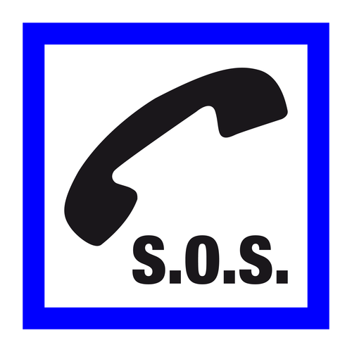

# Intoxicaciones

 

Si partimos de la base de que un **tóxico** es cualquier sustancia que introducida en el organismo ocasionará en él una lesión, la **intoxicación** es el trastorno que produce esa sustancia tóxica en el organismo.

Como bien sabes, el tóxico, y más en un niño, **puede introducirse por varias vías:**

1.  Digestiva
2.  Tópica
3.  Respiratoria...

Como es uno de los accidentes más peligrosos, es importante que sepa qué tienes que hacer en estas **3 situaciones de intoxicación: **

*   **De contacto:**
    *   Ponte guantes antes de tocarlo
    *   Quítale la ropa
    *   Lávalo en la ducha con agua a chorro, no menos de 20 minutos, procurando que la temperatura del agua no esté ni muy fría ni muy caliente
    *   Si te quedas preocupado, avisa al 061

*   **Por inhalación:**
    *   Ventila bien la zona en la que se encuentre
    *   No os demoréis en la salida de ese lugar pronto, porque si no es así tú también te puedes intoxicar
    *   Avisa al 112
    *   **Si el niño está inconsciente** y:
        *   **Respira,** mantengo en la posición lateral de seguridad, tumbado de costado en el suelo, tal y como aprenderás en el Módulo 2
        *   **No respira:** inicia la reanimación cardiorespiratoria (lo aprenderás también en el módulo siguiente)

*   **Digestiva**
    *   Fíjate en el tóxico que es
    *   Llama al teléfono de **información toxicológica: 915620420** (Seguro que lo tienes en la agenda de tu móvil, ¿verdad?)
    *   Sigue las instrucciones que te digan

>**danger**
>
>## Importante
>
>Si la intoxicación es por vía digestiva, no provoques el vómito, ni administres algunos líquidos como leche, aceites...
>
>Informa siempre a los padres

