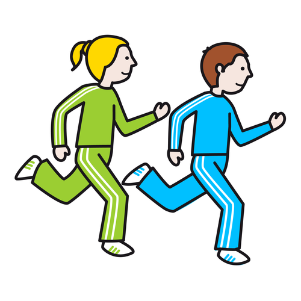

# La actividad física

 Fig.3.21. Correr- Sergio Palao. ARASAAC. Licencia CC (BY-NC-SA)

 El joven con cardiopatía **debe realizar ejercicio físico**, ya que mediante el juego y el deporte, como bien sabes, contribuyen a su desarrollo psíquico, físico, motriz, etc.

Fíjate que **es el propio niño el que va a limitar su actividad**, ya que se siente cansado, y modera la intensidad del ejercicio físico.

Sin duda, el **profesor de educación física** es la persona que va a tener más conocimientos, ya que los padres habrán llevado al centro un informe médico con orientaciones sobre las actividades físicas y deporte que puede realizar.

 **Durante el ejercicio** puedes encontrarte con varias situaciones:

1.  **Que el sobreesfuerzo o la competición no le permita al niño actuar como sus compañeros**, por lo que tiene que adaptarse o modificarse la actividad deportiva, ya que le puede faltar la respiración, y frecuentemente en esta situación los labios y piel se vuelve de color azulado. En estos casos t**ienes que permitirle descansar**, así como **siempre que te diga que lo necesita.**
    
2.  **Que su cardiopatía le limite mucho el sobreesfuerzo,** por lo que, en lugar de optar por que no realice actividad física, puedes recurrir a tu ingenio una vez más, por ejemplo nombrándole "ayudante tuyo" **con una misión importante y no excluyente entre sus compañeros de clase a la hora de hacer deporte.**
    

Tal y como te hemos dicho en el apartado de la medicación, por el uso de anticoagulantes, existen **deportes menos recomendados,** como son los de contacto (rugby, judo, fútbol...) y riesgo de caídas (barranquismo, escalada, patinaje, esquí...).

