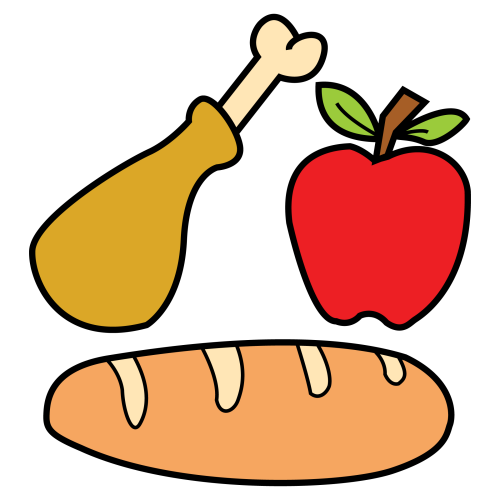

# Otros Trastornos

Fig.4.6. Gimnasia. Sergio Palao. ARASAAC. CC BY-NC-SA

 **Trastornos aliment****arios no especificados (“vigorexia”, “ortorexia”, etc.)**

 Los llamados Trastornos de la Conducta Alimentaria No Especificados (TCANE) son cuadros incompletos de AN o de BN, es decir, tienen unos signos y síntomas similares a las enfermedades antes descritas, pero sin llegar a definir claramente unos criterios que los diagnostiquen como tales.

 **¿Qué es la Vigorexia?**

**Se define** como una obsesión por un cuerpo musculoso, término que se definió en el año 1993: sin duda, vemos que este** trastorno mental novedoso** que cada vez va en mayor aumento, vinculado a una tendencia excesiva por tener un cuerpo musculoso. Además hacen limitaciones importantes en las comidas, rechazando alimentos grasos y aumentando la cantidad de ingesta proteica para alcanzar objetivos. El vigoréxico tiene una alteración en la percepción de su imagen corporal, viéndose excesivamente delgado, lo que le lleva a hacer unas dietas desequilibradas.

**Afecta más** a los hombres, y les lleva a romper el equilibrio del bienestar emocional, ya que la obsesión entra a formar parte de sus acciones, encaminada a adquirir una apariencia atlética. No es infrecuente el consumo de sustancias anabolizantes para ayudar a conseguirlo.

Elimina grasa mediante una alimentación inapropiada, duros entrenamientos, mirarse constantemente en el espejo...

Las **complicaciones** a largo plazo son las enfermedades por daño a músculos, articulaciones, tendones..., así como alteración en la conducta social, interferencias entre la casa, la escuela, el trabajo..., imposibilidad de mantenerse relajado, así como efectos adversos de las drogas utilizadas para lograr sus objetivos.

Fig.4.7. Comida. Sergio Palao. ARASAAC. CC BY-NC-SA

 **¿Qué es la Ortorexia?**

La ortorexia hace relación a la obsesión que tiene la persona por comer alimentos sanos.

Este trastorno se diferencia del resto en que aquí no es lo importante cuánto se come, sino qué **calidad tiene lo que se come,** en forma de obsesión patológica, de forma, que lo que aparentemente podría parecer saludable se convierte en todo lo contrario.

Fíate en estos puntos, que nos acercan a entender el **comportamiento** de la persona ortoréxica:

*   Pasar más de 3 horas diarias pensando en cómo comer una alimentación sana
*   Obsesión compulsiva por comer alimentos naturales
*   Excluir de la alimentación grasas, alimentos que se han tratado con herbicidas, etc 
*   Preocupacón excesiva por la calidad del alimento que por comerlo
*   Disminución progresiva de la calidad de vida debido a su dependencia a la calidad del alimento
*   No se salta jamás las normas de su alimentación
*   Aislamiento social por su comportamiento
*   etc

Lógicamente, las **complicacione**s se relacionan con alteraciones en el metabolismo, por los desórdenes en los nutrientes, minerales, vitaminas y sales, alteración del hierro y masa corporal, anemias, y graves alteraciones en la salud mental.

**Con estas claves, tú, como docente,** quizá puedas intuir si algún adolescente en tu aula o centro escolar esté iniciando algún comportamiento de este tipo. ¿Qué opinas?

## Pregunta Verdadero-Falso

### Pregunta 1

Respecto a la ortorexia:un docente no se puede dar cuenta de que uno de sus alumnos adolescentes tiene este trastorno mental, ya qu es típico que la mayor parte de nuestros jóvenes hagan una vida sana, con ejercicio y buena comida. Todas las personas que son modelos serían ortoréxicas

 Verdadero  Falso

#### Retroalimentación

**Falso**

