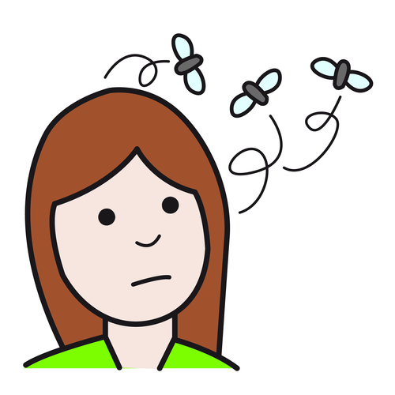

# ¿Qué es la epilepsia?

 Fig.3.34. Despistada. Sergio Palao. ARASAAC. Licencia CC BY-NC-SA

En el año 2013 se ha evidenciado, a través de los resultados preliminares del estudio Epiberia, que en España existen 12 casos de epilepsia por cada 1.000 personas, es decir, **unas 705.000 personas tendrían esta enfermedad en nuestro país,** lo que hace de la epilepsia una enfermedad muy prevalente. El día nacional de la epilepsia en España es el 24 de mayo.

  
**Diferencia entre estos términos** que son parecidas, pero no iguales:

1.  **Convulsión (crisis epiléptica):** es una alteración brusca y transitoria que está causada por una actividad anormal de un grupo amplio de neuronas, y que puede causar una serie de sensaciones, emociones y comportamientos inusuales, contracción involuntaria de los músculos (espasmos) y pérdida del conocimiento.
2.  **Epilepsia:** es la predisposición a tener crisis epilépticas repetidas. Una persona decimos que tiene epilepsia si ha tenido 2 ó más crisis epilépticas. El síntoma típico de la epilepsia es la crisis
3.  **Síndrome epiléptico:** es el conjunto de todos los factores que se asocian a la crisis epiléptica, y sirve mucho a los médicos para valorar el tratamiento en lo que respecta al estilo de vida, y valorar la evolución de la enfermedad. Incluye muchos tipos y causas.

**Tratamiento de la epilepsia**

Gracias a la medicación antiepiléptica cerca del 80% de las personas que tienen esta condición de salud pueden llevar una vida plena, algo que desde la escuela en muchas ocasiones no percibimos. La base del tratamiento consiste en:

**Medicación:** se utiliza para disminuir la irritabilidad de las neuronas, con lo que reducimos el riesgo de que se produzca una crisis.

**Estilo de vida:** enfocado fundamentalmente a la realización de actividad física saludable, alimentación correcta, evitar el alcohol y otras adicciones, así como dormir las horas necesarias.

**Cirugía:** sólo para pacientes seleccionados, existe la posibilidad de operación. 

## Importante

*   La epilepsia es una enfermedad crónica que bien controlada permite una vida normal
*   No es una enfermedad contagiosa
*   Tener epilepsia no significa tener menor capacidad intelectual
*   En el tratamiento de la epilepsia se incluye el bienestar emocional, en el que participan activamente las personas más informadas que conviven con el niño.
*   Los síntomas principales de la enfermedad son las crisis epilépticas

