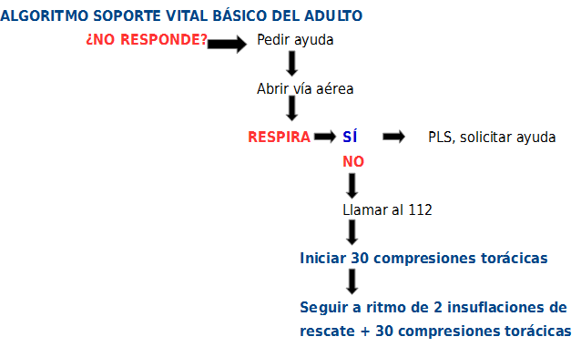

# Que pasos debemos seguir

Como vas a comprobar, el inicio es la parte correspondiente a lo que ya has estudiado en Primeros Auxilios y lo debes saber hacer: por lo tanto, te sirve de recordatorio, y te lo recordamos para que comprubes las secuencias encadenadas.

>**danger**
>
>## Importante
>
>### **PREMISA A RECORDAR SIEMPRE Y EN TODO MOMENTO:**
>
>**Los pasos de la RCP siguen una secuencia lógica para garantizar la efectividad y éxito de la técnica. Por ello no debemos saltarnos ningún paso.**

### Recomendaciones del Plan Nacional de RCP, adaptadas a Covid-19

Según las **recomendaciones del Plan Nacional de RCP, adaptadas a Covid-19,** “en el ámbito de la comunidad, las recomendaciones y la prudencia nos dicta a considerar a cualquier víctima en situación de Parada CardioRespiratoria (PCR) como si fuera una víctima con posible infección por COVID-19 y, por tanto, transmisor de la enfermedad para el reanimador que lo atienda. Por ello, resulta razonable adaptar la secuencia de atención a la PCR.”

**Tales recomendaciones PARA LOS PASOS A SEGUIR son:**

**1. COMPROBAR QUE LA ZONA ES SEGURA:** antes de iniciar la RCP, como siempre, comprueba que la zona es segura. 

**2. PROTECCIÓN INDIVIDUAL:** debido al riesgo de infección, tú como reanimador puedes cubrir la boca y nariz de la víctima con una mascarilla -en el caso que no la lleve-  (si dispones de mascarilla quirúrgica, mascarilla KN95/FFP2) para evitar el efecto aerosol. No olvides protegerte con tu mascarilla antes de iniciar las maniobras de RCP.

**3. VALORA EL PARO CARDÍACO:** busca la ausencia de signos de vida y de respiración normal: para poder determinar la ausencia de respiración normal, no abras la vía aérea mediante la maniobra frente-mentón (que conoces) y no realices la maniobra “ver-oír- sentir” para comprobar si respira. 

**- Si la víctima está inconsciente y no respira normalmente,** asume que está en situación de PCR. 

- **Si la víctima está inconsciente pero tiene una respiración normal perfectamente objetivable,** colócalo en Posición Lateral de Seguridad, si no sospechas que exista riesgo de lesión medular, por ejemplo en el contexto de un accidente.

**4. PIDE AYUDA:** llama al 112 y activa el altavoz u otra opción de manos libres en el teléfono móvil.

**5. INICIA MANIOBRAS RCP:** con solo compresiones torácicas ininterrumpidas hasta que llegue la ayuda que has solicitado. 

La pauta es: profundidad 5-6 cm, frecuencia 100-120/min. **Muy Importante: NO intercales las respiraciones de rescate (respiraciones boca a boca) con las compresiones.**

**6. PIDE UN DESFIBRILADOR EXTERNO AUTOMÁTICO (DEA):** pídeselo a un testigo que esté contigo, por si hubiera uno cercano en un espacio cardioprotegido (es importante que esta información la sepáis).

**7- LLEGADA DEL DEA:** enciéndelo y abre el dispositivo.

*   Coloca los parches autoadhesivos sobre el pecho de la víctima y sigue las indicaciones de los mensajes de voz/visuales del DEA. 
*   Un electrodo se coloca bajo la clavícula derecha y otro en la línea media axilar izquierda (costado izquierdo a unos 10 cm de la axila).
*   Es importante que nadie toque a la víctima mientras el DEA realiza el análisis del ritmo cardíaco.

El uso precoz de un desfibrilador multiplica las posibilidades de supervivencia de la víctima y no aumenta el riesgo de transmisión de la infección.

**8- HIGIENE DE MANOS TRAS LA REANIMACIÓN:** tras la RCP con solo compresiones torácicas, todas las personas que han intervenido y tan pronto como sea posible,debéis lavaros bien las manos con agua y jabón o solución hidroalcohólica, para minimizar el riesgo de transmisión por el contacto con los fómites de la víctima. Además, se aconseja lavar la ropa utilizada durante las maniobras de RCP.

**Nota: a continuación te dejamos para su visionado las recomendaciones clásicas, para que puedas comprobar los cambios introducidos.**

**Te aconsejamos la consulta de la bibliografía**

### **Pasos en la RCP:**

**1.Verificar el nivel de consciencia de la persona (paciente a partir de ahora).**Podemos preguntar cómo se encuentra o practicarle leves sacudidas o palmadas, siempre y cuando tengamos la certeza de que no padece ninguna posible lesión en el cuello o en la cabeza debido a un accidente. Se debe observar si se mueve o emite algún ruido.

**1.1 Si obtenemos respuesta.** Si el paciente responde moviéndose o verbalmente, deberemos dejarlo en la posición lateral de seguridad (a menos que esté expuesto a algún peligro adicional), comprobar su estado y pedir ayuda si fuera necesario.

**1.2 Si no obtenemos respuesta, pedir ayuda.** Si el paciente está inconsciente debemos pedir ayuda a alguna persona cercana. Si no hay nadie cerca no debemos dejarlo solo.

**2\. Colocar al paciente boca arriba.** Debemos tumbar al paciente sobre una superficie dura y plana, con la cabeza boca arriba y las extremidades alineadas. Es importante evitar rotar la cabeza y el cuello, ya que si el paciente ha sufrido un accidente podría tener lesiones cervicales.

**3\. Abrir las vías respiratorias.** Para la apertura de las vías respiratorias se realizará la maniobra llamada "frente-mentón" destinada a facilitar la entrada de aire por la boca.

*   Para evitar que la lengua caiga hacia atrás, debemos levantar la barbilla con la cabeza fija y con una mano.
    
*   A la vez, con la otra mano inclinaremos la cabeza del paciente hacia atrás empujando la frente hacia abajo con la otra mano.
    
*   En caso de presencia de un cuerpo extraño visiblemente y fácilmente extraíble en la boca, se intentará retirarlo con la punta de los dedos, pero nunca deberemos realizar un barrido a ciegas de la cavidad bucal.
    

**4.Valorar y comprobar la respiración del paciente.** Debemos situar nuestro oído cerca de la nariz y boca del paciente y observar el tórax para comprobar si respira.

*   Observaremos, escucharemos y sentiremos durante no más de 10 segundos antes de decidir si la víctima respira con normalidad.
    
*   Si hay alguna duda actuaremos como si NO fuera normal.
    

**5\. Si respira, lo colocaremos en posición lateral de seguridad (PLS)** siempre que sea posible y llamaremos a urgencias hasta la llegada de los equipos asistenciales comprobando en todo momento su respiración. ¡Ya sabes hacerlo, recuérdalo!

**6\. Si el paciente no respira y estamos acompañados de otra persona, debemos indicarle que avise a emergencias (112)**. Mientras, nosotros no nos separaremos del paciente e iniciaremos la respiración artificial (boca-boca). ¡Ya sabes hacerlo, recuérdalo!

Para ello, nos colocaremos de rodillas junto a la cabeza del paciente y seguiremos los siguientes pasos:

1.  Abrir las vías aéreas.
    
2.  Tapar la nariz del paciente.
    
3.  Inspirar profundamente.
    
4.  Colocar nuestros labios alrededor de la boca del paciente (si es menor de un año podemos cubrir boca y nariz a la vez de manera que quede completamente sellada).
    
5.  Hacer 5 insuflaciones de rescate (soplos) uniformes hasta comprobar que el tórax del niño se eleva. Retirar la boca para tomar aire y observar que el tórax vuelve a bajar. Entre cada insuflación debemos mantener la posición de la cabeza y las manos, pero debemos retirar la boca para facilitar la respiración.
    

Mientras se realizan las insuflaciones de rescate, deberemos comprobar si provocan alguna respuesta en forma de movimientos, respiraciones o tos. Si no conseguimos que entre aire, deberemos sospechar que algún objeto está obstruyendo las vías respiratorias.

**7\. Comprobar signos de vida. Para comprobar los signos de vida deberemos observar signos de tos, movimientos y/o respiración.**

*   **Si presenciamos signos de vida**: seguir con la ventilación boca a boca a un ritmo de 20 por minuto hasta la llegada de los servicios de asistencia comprobando en cada momento su estado de respiración y los latidos de su corazón.
    
*   **Si NO presenciamos signos de vida:** **si el niño sigue inconsciente, no respira, no se mueve o tiene mal color, son otros signos de que su corazón no late. Iniciaremos las compresiones torácicas.**
    

**8\. Realizar las compresiones torácicas.** El objetivo es comprimir el tórax contra la espalda de forma rítmica para conseguir que la sangre salga del corazón y circule por el cuerpo.

Colocaremos al paciente boca arriba en un plano duro y con las extremidades alineadas y seguiremos estos pasos:

*   Colocar el talón de la mano en el esternón, justo por debajo de los pezones, nunca en el extremo del esternón.
    
    *   En los niños menores de 1 año colocaremos 2 dedos
        
    *   En niños mayores de 8 años podemos utilizar las 2 manos.
        
*   Colocar la otra mano de manera que aguante la frente un poco inclinada hacia atrás.
    
*   Aplicar presión hacia abajo en el pecho del niño comprimiéndolo entre 1/3 y 1/2 de su profundidad.
    
*   Hacer 30 compresiones dejando que el pecho se eleve completamente. Deberemos hacer estas compresiones de forma rápida, fuerte y sin pausa.
    
*   A continuación hacer 2 insuflaciones más.
    
*   Continuar la RCP (30 compresiones cardíacas, seguidas de 2 insuflaciones y repetir)
    

**9\. Llamar a urgencias y comprobar signos de vida**. Si al cabo de un minuto de empezar la RCP, seguimos solos y no hemos podido llamar a urgencias (112), deberemos hacerlo en este momento aunque para ello tengamos que abandonar momentáneamente al niño.

A los 2 minutos deberemos comprobar la eficacia de nuestras maniobras: aparición de signos de vida y/o respiración espontánea.

**10.Finalizar la RCP.** Deberemos continuar combinando 30 compresiones torácicas con 2 ventilaciones hasta que:

*   Llegue la ayuda del profesional
    
*   La víctima recupere la respiración efectiva
    
*   Estemos exhaustos

Es importante recordar que no es recomendable realizar maniobras de reanimación con el lactante en brazos y en movimiento. Sólo de forma excepcional, podemos movilizar al niño en caso de que nos desplacemos para solicitar ayuda y continuar las maniobras en el otro lugar.

>**info**
>
>El 21/10/2020 se publicaron las **nuevas guías AHA 2020** (_2020 CPR&ECC guidelines_) con las nuevas recomendaciones ante una RCP, que integran lo publicado anteriormente: lo importante para ti es que NO se incorporan aspectos específicos respecto a la RCP en el contexto pandémico COVID19 excepto lo referente a la respiración.

https://youtu.be/XopewSZdwu8
