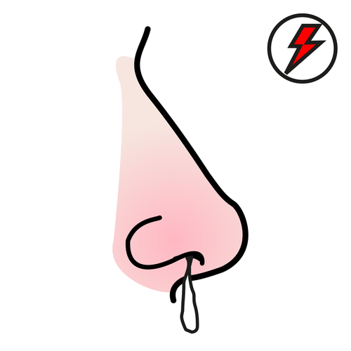

# Rinoconjuntivitis

 Fig.3.7. Resfriado. Sergio Palao. ARASAAC. Licencia CC BY-NC-SA

No te asustes con este nombre tan complicado: se llama así al conjunto de procesos que afectan a la nariz y a la conjuntiva de los ojos por un alérgeno.

*   La **Rinitis e**s la inflamación de la mucosa nasal con secreción nasal, estornudos, taponamiento nasal y/o picor de la nariz, y la rinitis alérgica es la respuesta inmune frente a alérgenos (p. ej. polen de gramíneas, ácaros del polvo o mascotas)
*   **Se asocia a síntomas oculares** (rinoconjuntivitis)
*   **Produce** irritación nasal y taponamiento con efectos secundarios: interferir el sueño nocturno y provocar somnolencia durante el día
*   Recuerda cuando veamos a continuación el asma que la presencia de rinitis alérgica frecuentemente lo exacerba.

**Para la escuela existen unos retos importantes:**

*   No es de riesgo vital
*   El principal efecto perjudicial es sobre la calidad de vida
*   Recuerda que puede reducir el **rendimiento en los exámenes** si hay síntomas, y también puede existir una disminución de la actividad mental en los niños que toman los fármacos para su tratamiento: los **antihistamínicos**

**Puntos que debes tener en cuenta como profesor:**

*   Debes permitir al niño con alergia que **tome su medicación** para tratar los síntomas en la escuauela cuando lo necesite
*   No reprendas al niño alérgico por **mostrar síntomas alérgicos frecuentes** como estornudar o aspirar mucosidad por la nariz
*   Debes  prever un aumento de síntomas durante las actividades exteriores en temporada alta
*   Tienes que ser consciente de que la rinoconjuntivitis puede reducir el rendimiento en los exámenes y empeorar el asma

