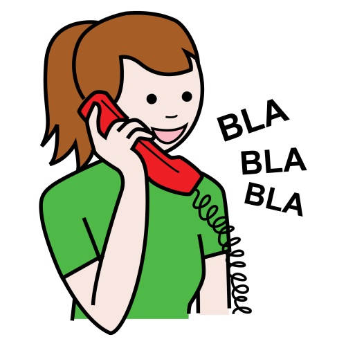

# Tratamiento farmacológico

 Fig.3.37. Hablar por teléfono. Sergio Palao. ARASAAC. Licencia CC (BY-NC-SA)  

### Respecto al tratamiento farmacológico durante la crisis

Para el tratamiento de la crisis existe un **fármaco antiepiléptico** que es el **Diazepam rectal,** que se administra por el recto (al igual que los supositorios), pero en otro formato.

Su administración es de 5 mg para los niños menores de 3 años y de 10 mg para los mayores de 3 años.

**Para administrarl**o el niño tiene que estar tumbado en el suelo para introducir la cánula del medicamento por el recto, totalmente si es menor de 3 años, y hasta la mitad de la cánula (tiene un reborde) si es mayor de 3 años. Se introduce todo el líquido y se sujetan ambas nalgas para evitar que se salga el medicamento.

Se administra** lentamente,** y si antes de terminar cede la crisis, se deja de administrar.

Para administrar el Diazepam rectal es necesaria la **documentación pertinente:** informe del médico responsable, así como autorización escrita de la familia.

Te recomendamos **visionar el material multimedia,** donde podrás comprender claramente todas esta actuación.

**Recuerda siempre** los **teléfonos** facilitados por la familia para saber dónde hay que llamar

*   Teléfono del contacto familiar
    
*   Teléfono del equipo sanitario que controla al niño
    
*   112
    

