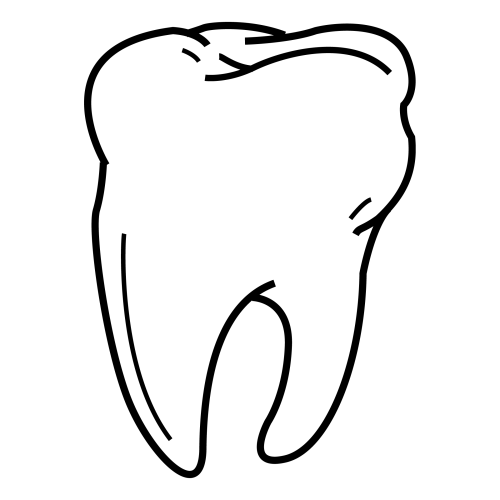

# Traumatismo bucodental

**Son lesiones** que se producen tras un traumatismo en las partes blandas de la cara con o sin lesiones en los dientes.

La **pieza dentaria** que más frecuentemente se afecta es, en orden de frecuencia: incisivo central superior, incisivo lateral superior e incisivo central inferior

**Las causas que los producen suelen ser:**

Caídas al suelo, por las escaleras, al jugar en el patio, chocar contra otros compañeros u objetos, accidentes en vehículos y al realizar deportes... (no podemos olvidar el maltrato, en ciertas ocasiones)

**Se puede producir tras el traumatismo:**

*   **Fractura del diente:** se rompe un fragmento del mismo la rotura de un fragmento del diente.
*   **Luxación del diente:** se desplaza dentro de su alvéolo, pero no se sale del mismo
*   **Avulsión:** se llama así a la salida completa del diente de su alvéolo, que además ha fracturada la entrada y salida de vasos sanguíneos y nervios

**Que puedes hacer:**

*   **En el traumatismo de la boca y los dientes:**
    *   Limpia suavemente la boca, pudiendo utilizar antiséptico bucal
    *   Si ves que hay hinchazón en la zona, aplica frío local
*   En caso de **traumatismo dental en dientes permanente**s (en niños mayores de 6 años)
    *   Localiza el diente y cógelo ¡ojo, no de cualquier forma!, evitando que se lo trague
    *   Tócalo sólo por la zona de la corona

 

**Conserva la pieza dentaria en:**

*   Leche
*   Solución salina
*   Suero fisiológico...
*   La propia saliva debajo de la lengua si no tienes otros medios, y siempre y cuando el niño sea mayor, evitando que lo trague.

**Informa rápidamente** a los padres, y solicitar ayuda porque es fundamental la derivación al dentista, ya que el diente **podría implantarse** en un plazo recomendado **no superior a las 2 horas**, y cuando antes mejor

>**danger**
>
>## Importante
>
>*   No manipular el diente: no tocar la raíz, no lavarlo con agua o solución antiséptica y no secarlo con gasas, no frotarlo...
>*   No transportar el diente en seco o en agua sin más.
>*   No demorar la derivación del niño o niña al dentista
>*   Localiza urgentemente la pieza dentaria y traspórtala adecuadamente y a ser posible en menos de media hora al odontólogo o dentista

