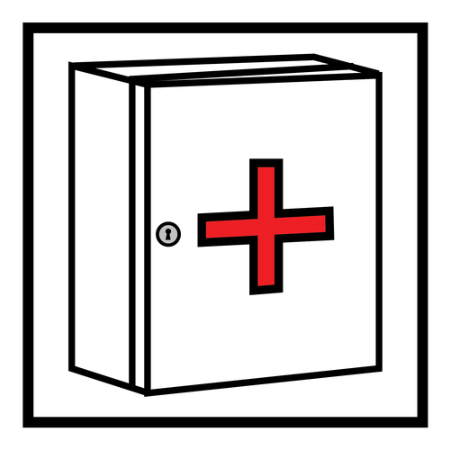

# U1. Botiquín escolar

 

Fig.4.2. Botiquín. Sergio Palao. ARASAAC. CC BY-NC-SA

El centro docente ha de tener un **botiquín de contenidos básicos****,** para **poder atender** a las necesidades de sus alumnos en temas relacionados con la salud (**primeros auxilios**).

**El** **botiquín ideal** debe ser:

1.  Tener poco peso, portátil, con asas: para poder transportarse sin esfuerzo
2.  Carecer de cerradura con llave
3.  De material resistente, con cierre hermético
4.  Fácilmente identificable por todos, gracias al pictograma de socorro en su exterior

Es muy importante que **se localice** en una **zona conocida** por **todas las personas del centro** (profesorado y personal no docente), para evitar pérdida del tiempo explicando dónde se encuentra (en estas situaciones en las que lo principal es actuar con urgencia).  Si puede ser, el botiquín escolar debe situarse en una **instalación** en la que se puedan realizar procedimientos de primeros auxilios, con el fin de hacer más operativa la actuación. Recuerda que el ambinte ha de tener **condiciones medioambientales que no alteren su contenido.**

El **contenido** se colocará en orden respetando grupos y zonas, y **estar controlado** por el Equipo Directivo que recibirá asesoramiento por los profesionales del centro de salud correspondiente.

Los **teléfonos** **de emergencia** estarán junto al botiquín, perfectamente visibles para poder ser utilizados cuando se precisen (el centro docente puede colocarlos, además, en otros espacios que considere); los **teléfonos importantes** son:

*   Emergencias: 112
*   SALUD Aragón – Urgencias y emergencias sanitarias: 061
*   Emergencias Toxicológicas: 91 5620420
*   Bomberos de la zona o localidad:
*   Centro de salud de referencia (urgencias):
*   Otros:

También es importante destacar la conveniencia de que exista una **guía de actuación****.**

**Un botiquín básico deberá tener,** **al menos:**

**Utensilios:**

*   Tijeras de acero inoxidable.
*   Pinzas de acero inoxidable.
*   Termómetro digital.
*   Guantes quirúrgicos desechables.
*   Bolsa de hielo sintético.

**Material fungible:**

*   Apósitos adhesivos.
*   Parches y tiritas para botiquines.
*   Esparadrapo ancho de tela.
*   Gasas estériles (en paquetes pequeños).
*   Suero fisiológico en monodosis.
*   Solución desinfectante (preferible clorhexidina en spray).
*   Compresas desechables.
*   Tabletas de glucosa.

## Importante

-El botiquín escolar debe estar situado en un lugar conocido por todos, con una persona del Equipo Directivo que tenga entre sus funciones el mantenimiento interno y externo del mismo

-Los teléfonos de urgencia necesarios estarán junto al botiquín, y en los lugares que se estime oportuno

## Pregunta Verdadero-Falso

### Pregunta 1

Respecto al botiquín médico debe tener, entre otras, la medicación de urgencia necesaria para atender al alumno con enfermedades crónicas, como, por ejemplo, el glucagón para una hipoglucemia grave

 Verdadero  Falso

#### Retroalimentación

**Falso**

### Pregunta 2

El desinfectante ideal para su utilización por su comodidad es el Betadine® ya que es ampliamente conocido por todas las personas.

 Verdadero  Falso

#### Retroalimentación

**Falso**

