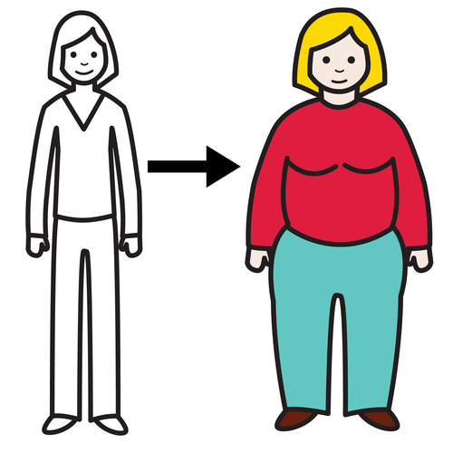
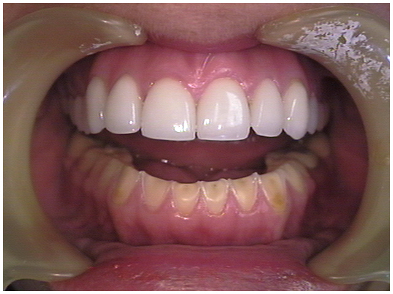

# U2. Otras condiciones de salud

**ANOREXIA Y BULIMIA NERVIOSA**

La Anorexia nerviosa (AN) y la Bulimia Nerviosa (BN) son dos enfermedades representantes de los "Trastornos de la Conducta Alimentaria" (TCA). La clínica típica que caracteriza la AN es adelgazamiento, amenorrea y anorexia en una chica entre los 12 y los 20 años.

La causa de los TCA es biopsicosocial, porque intervienen factores biológicos, psicológicos y sociales. 

**La importancia del adolescente en el aula**

*   **Evita ponerse o ropa ajustada,** que no se relaciona con la estación del año, o va excesivamente abrigado, porque siente hipotermia al tener poca grasa corporal.
*   **Se compara** en exceso con el resto de sus compañeros, y normalmente hace comentarios muy despectivos de su cuerpo.
*   Tiene **preocupación excesiva por la moda,** por la ropa, y hace muchos comentarios relacionados con ésta.
*   En las **bulimias** al vomitar se producen **lesiones en los dedos** para producirse la arcada en el esfuerzo de vomitar, o bien son como **pequeñas heridas** producidas por el ácido del estómago de forma repetitiva
*   En las **Bulimias**, si vomitan mucho ácido, tienen d**eterioro de las piezas dentaria**s o color grisáceo por los vómitos repetitivos.
*   Por la falta de potasio y alteración hidroelectrolítica por los vómitos son frecuentes los **calambres**
*   Tienen un cambio en su conducta, o más irritables o más inhibidos, y muestran desinterés en la clase y menor concentración.
*   **Excesivo movimiento en la silla**, o necesidad de levantarse de forma repetitiva durante la clase.
*   Por **ansiedad** también es frecuente observar las **autolesiones:** rascado excesivo, tocarse el pelo (incluso morderlo, romperlo), morderse las uñas, morder los bolígrafos de forma excesiva.
*   Demanda excesiva de **ir al baño** con cualquier pretexto (suelen ir para orinar vomitar). Otras veces es cierto, ya que utilizan laxantes.
*   Normalmente **desmenuzan la comida** y la apartan para disimular que **no se la han comido** o se la guardan y la esconden para luego tirarla a la **basura.** otras veces se sientan al lado de alguien que comen más y se la dan
*   Se queja frecuentemente del exceso de la comida o de que son alimentos densamente calóricos.
*   Come menos o intenta repetir el lato (dependiendo si es anorexia o bulimia)
*   Conversa frecuentemente sobre quién está más delgado de la clase, y **cómo llegar al cuerpo ideal.**
*   En un primer paso sustituye un bocadillo por fruta, y en un segundo paso, no come nada
*   En la **Anorexia purgativa** busca un baño para vomitar, o intenta hacer ejercicio nada más comer, y al final aparecen los trastornos sociales y psicológicos de aislamiento social, problemas con la familia, etc

**Si tienes intuición de que alguna per****sona de tu centro puede tener un TCA, puedes...**

*   Compartir tus dudas con otro docente
*   Reunirte con quien más relación tenga con esa persona, para que actúe como intermediaria, ya que a veces no quiere hablar de estos temas con sus padres, y el profesor puede servir de acercamiento
*   **Se pueden utilizar numerosas habilidades para la vida que ayuden a los adolescente a acercarse entre ellos y hacer que crezca su autoestima**
*   **Es importante la colaboración con asociaciones, como en el caso de Aragón, la asociación Arbada, que ha editado un audiovisual :** "Comer bien, verse mejor", adolescencia y alimentación: Prevención de trastornos de la conducta alimentaria en adolescentes.
*   Dura 6 minutos y sirve para utilizarse como material DVD para prevenir los trastornos de la conducta alimentaria en los adolescentes y por medio de imágenes cotidianas ayudar a asimilar el crecimiento y los cambios durante la adolescencia.

## Pregunta Verdadero-Falso

<quiz name=""><question>
A las personas anoréxicas no les gusta la comida por un gen ligado al cromosoma X. esta predisposición genética hace que cada ciertas generaciones en una familia haya al menos una persona con anorexia nerviosa. Al ser ligada al sexo, suelen ser mujeres. De ahí que la anorexia no tenga actualmente curación, al contrario que la bulimia
<answer>Verdadero</answer><answer correct>Falso</answer></question></quiz>
