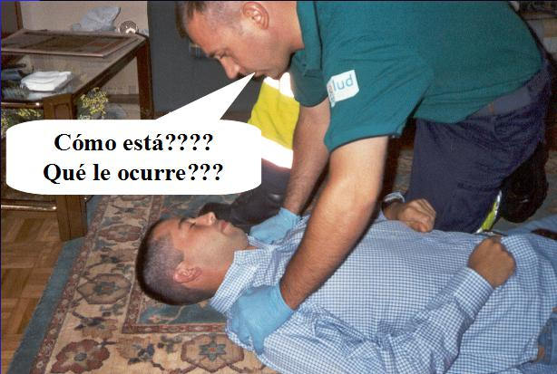

# U2. Primeros auxilios

Los primeros auxilios **consisten** en prestar asistencia necesaria a una persona que lo precisa por estar afectada su salud de forma repentina, o que sufre un episodio de urgencia.

Sabemos que **tú, como docente,** en no pocas ocasiones te has visto o te podrás ver implicado en una situación en la que se requiera de **tu actuación** en primer lugar, tanto **de tipo emocional como físico.**

Siguiendo las recomendaciones científicas actuales con sus adaptaciones temporales describimos a continuación lo que debes hacer dentro del contexto de tu centro educativo (las situaciones de Reanimación Cardiopulmonar las explicaremos en el M2 y también te lo explicaremos para que puedas realizarlas fuera de la situación propia de las aulas).

Las guías aplican sus recomendaciones para realizarlas por personal sanitario sobre personas desconocidas: de ahí la necesidad de extremar las precauciones y protegerse. Incorporan como novedades: 

* Al evaluar la respiración, buscar una respiración normal. Para minimizar el riesgo de infección, no abrir las vías respiratorias y no colocar la cara junto a la boca o nariz de la víctima. No manipular las vías respiratorias. Se debe de utilizar la observación de los movimientos del tórax y los ruidos respiratorios.
* Si al principio estás solo/a y debes llamar por teléfono, utiliza el manos libres para ser más eficaz en el tiempo.

Como seguramente tendremos muchas cuestiones que plantear, las discutiremos en el foro.

**IMPORTANTE: MANEJO RESPIRATORIO DE UN NIÑO EN ESTADO GRAVE**

**Mantener las vías aéreas operativas**, con independencia del estado COVID-19 del niño, es la parte fundamental del manejo respiratorio de cualquier niño que esté grave o lesionado.

Si es estrictamente necesario abre y mantén la vía aérea mediante la maniobra que estudiaremos más adelante.

La secuencia de actuación en Primeros auxilios se basa en la **Regla "PAS",** de forma que sería:

P = Proteger al alumno que necesita ayuda

A = Avisar al 061 ( o en su caso al teléfono de información toxicológica ¿lo recuerdas?

S = Socorrer, una vez hecho lo anterior se puede iniciar la secuencia de primeros auxilios

**La asistencia inicial** se expresa con otra expresión, que es el **"ABC",** que te servirá para priorizar tus acciones ordenando los pasos a seguir:

A = de Alerta o Consciencia

B = respira bien

C = circulación de la sangre

**Es fundamental recordar el orden de la actuación**

