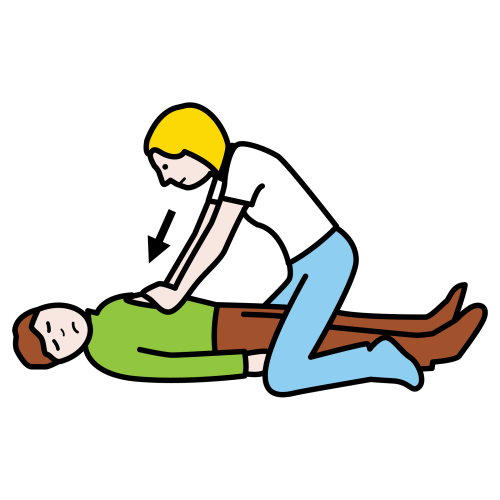

# U2. Reanimación Cardiopulmonar (RCP)

Te presentamos algo de debes aprender, como profesor, y ante todo, como ciudadano, ya que sabiendo hacer correctamente una RCP, realizada siguiendo unos pasos encadenados correctamente, puedes salvar una vida que, en algunos casos, dependa de tu conocimiento y buena voluntad.

**Recuerda** que es recomendable que te hagas tu propio esquema para recordar los pasos y las secuencias de insuflaciones/compresiones, y que los videos que te proporcionamos te serán de máxima utilidad.

¡Ánimo, es fácil y te sentirás muy bien cuando domines la técnica!

### **Qué es la REANIMACION CARDIOPULMONAR**

La Reanimación Cardiopulmonar Básica (RCP) es el conjunto de maniobras que permiten identificar si un paciente está en situación de parada del corazón y de los pulmones (cardiorrespiratoria) y realizar una sustitución de las funciones respiratoria y circulatoria, sin ningún equipamiento específico, hasta que la víctima pueda recibir un tratamiento más cualificado.

### **Por qué se produce esta situación:**

La parada cardiorrespiratoria se produce por varias causas:

*   Accidentes: de tráfico, por ahogamiento, atragantamiento con objetos, electrocución, intoxicaciones, asfixia u otras lesiones
    
*   Patologías: congénitas graves u otras patologías como la bronquiolitis, asma, tos ferina, etc
    
*   Infecciones graves: como la meningitis
    

### **Cómo prevenir esta situación:**

*   Prevenir lesiones por accidentes de tráfico. Utilizar sillas homologadas según la edad del niño y conducir con precaución y sentido común.
    
*   Prevenir atragantamientos con alimentos o cuerpos extraños. Enseñar al niño lo que debe comer y lo que no, y hacerlo de forma pausada. En niños más pequeños hay que estar atentos a que el niño no consuma objetos pequeños.
    
*   Dar al niño juguetes aptos para su edad, que hayan pasado todos los controles de seguridad y calidad.
    
*   Prevenir la ingesta de productos tóxicos. Mantener productos tóxicos, medicamentos, productos de limpieza, etc. fuera del alcance de los niños.
    
*   Enseñar al niño a nadar desde pequeño.
    
*   Enseñar al niño educación vial y a montar en bicicleta, triciclos, etc. de forma segura.
    
*   **Nunca subestimes lo que puede hacer un niño.**
    

### **Por qué hay que comenzar precozmente con las maniobras de resucitación:**

Si compruebas que en poco tiempo no se restablecen las funciones vitales dentro de la normalidad y el flujo de sangre del niño se detiene, esto puede causar daño cerebral o incluso la muerte. Por eso es importante continuar con la RCP hasta que vuelva el latido del corazón y la respiración de la persona o hasta que llegue ayuda médica

### **Quién debe comenzar la resucitación cardiopulmonar:**

La importancia de la RCP radica en que cualquier persona que conozca la técnica (padres, familiares, profesores, profesionales de la salud, etc.) puede realizarla en cualquier sitio y sin tener que esperar.

De hecho, es vital iniciar la RCP en los tres primeros minutos después de la parada cardiorespirratoria ya que sino, la probabilidad de que el paciente sufra secuelas es muy alto. La muerte puede ocurrir en tan sólo 4 ó 6 minutos.

**Qué síntomas nos tienen que alertar:**

*   Pérdida de conocimiento.
    
*   Paro respiratorio.
    
*   Ausencia de signos de vida.
    

Fíjate en la siguiente imagen… piensa qué es lo que añadirías en el momento actual de la pandemia… En efecto, las mascarillas.

