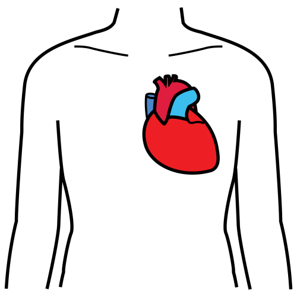

# U3. Cardiopatías congénitas

 Fig.3.18. Corazón. Sergio Palao. ARASAAC. Licencia CC BY-NC-SA

Seguramente sientas inseguridad y miedo si te dicen que vas a tener un niño con una cardiopatía congénita en tu clase, ¿verdad?... y es lo más normal.

**La cardiopatía es actualmente la enfermedad congénita más frecuente en los recién nacidos,** por lo que puede ocurrir que algún día te encuentres en el colegio con esta situación.

**En esta unidad queremos mostrarte** **información ágil** sobre las necesidades que puede tener un niño con esta condición de salud en el centro escolar, de forma que te sirva para minimizar esos miedos debidos, fundamentalmente, a la falta de información en el tema.

**Conseguirás habilidades** que te van a permitir saber actuar con actitud positiva y normalidad en tu horario docente y, además, algo que te importa muchísimo: que la escolarización se desarrolle sin angustia y haga que el niño con cardiopatía crezca con objetivos docentes logrados y madure con el mismo entusiasmo y alegría que sus amigos y compañeros de la clase.

**Hemos dividido esta unidad** de una manera muy sencilla, ya que lo que perseguimos es la resolución de dudas, conociendo en unas pinceladas qué son las cardiopatías congénitas y sus tipos, así como la escolarización del niño, su absentismo escolar y el ejercicio físico, como apartados fundamentales.

**Te animamos a reflexionar** a través de los recursos que te aportamos, en especial los de tipo multimedia. ¡Ánimo, seguro que te gusta!

