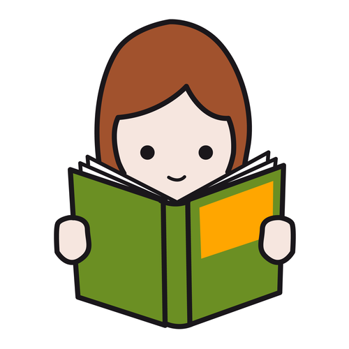

# U3. Instrucciones, procedimientos, etc

### **ADMINISTRACIÓN DE MEDICAMENTOS**

 

Fig.4.9. Lectura. Sergio Palao. ARASAAC. CC BY-NC-SA

Siempre ha sido voluntad del colectivo docente que el derecho a la asistencia no se vea dificultado por la necesidad de administración, ordinaria o de emergencia, de algún medicamento en horario escolar.

Sí es cierto que hay enfermedades para las que exclusivamente el personal sanitario está capacitado para realizar curas o administrar medicación (ordinaria o de emergencia) también es cierto que hay otras muchas que no requieren de personal especializado con titulación sanitaria. Nos referimos a todas aquellas situaciones en las que los facultativos encomiendan a las familias la administración ordinaria de medicamentos o la realización de pequeñas atenciones o curas. Por otro lado, también nos referimos a las situaciones de emergencia (ataque epiléptico, pérdida de conocimiento por hipoglucemia, anafilaxia, etc.).

**El sistema sanitario** es el que garantiza la atención y asistencia sanitaria de la **población escolar,** y le corresponde actuar, por norma, en los establecimientos de salud, actuando fuera de ellos por razones de urgencia sanitaria.

Los **profesionales** que trabajan en el **sistema educativo** (en este caso, tú que estás formándote en este curso) no tienen como funciones propias la **asistencia sanitaria al alumnado**, excepto **en los casos de urgencia vital**, al igual que lo haría cualquier ciudadano.

Por lo tanto, **la obligación general del docente** es prestar los **primeros auxilios básicos** que no requieren una formación específica, tratando en todo momento **de forma confidencial** la **información médica.**

Actualmente **por Ley existe un listado de enfermedades**  en los que el padre o la madre puede tener autorización de poder atender al niño y tener excepción laboral, lo que facilita muchísimo el procedimiento. Este familiar podrá, en el entorno escolar, realizar la tarea de cuidado del menor.

**Aparte de estas situaciones en las que se permite al familiar la excepción laboral, lo normal es que no se disponga de un familiar que pueda cubrir las necesidades del menor.**

**De forma general,** **los medicamentos se administrarán fuera del horario escolar.**

**Si la familia o tutor legal** **puede atender al menor en el horario escolar, se debe facilitar esta atención, siempre previa autorización del Equipo Directivo y con la coordinación del tutor.**

  

En el caso de las **enfermedades agudas o crónicas** es posible administrar medicación por vía oral a menores en el centro docente, de forma ocasional o prolongada, siempre que esta necesidad sea determinada por personal sanitario capacitado (facultativos especialistas).

**La familia o tutor legal** del alumno que tiene la enfermedad **debe informar** a la **Dirección del centro docente** al inicio del curso, o tras el diagnóstico; ésta **mantendrá una reunión** inicial con la **familia (o tutor legal) y personal sanitario del centro de salud** adscrito al centro educativo para recoger la información necesaria para posibles actuaciones.

**Si el profesional sanitario considera**  **necesaria** la administración de **medicación** o llevar a cabo alguna **actuación en el horario escolar** que no precise una titulación sanitaria por quien la lleve a cabo:

*   **Debe expedir una prescripción médica específica** para esta atención.
*   Se acompañará de un **consentimiento informado.**
*   Además, para que el personal del centro docente pueda administrar el medicamento prescrito, eximiendo de responsabilidad, **las familias deben presentar** una **autorización.**
*   Por último, debe haber un **registro individual de la administración de medicamentos al alumno.**
*   Estas situaciones pueden valorarse con el profesional sanitario del centro de salud adscrito al centro educativo.

### ACTUACIONES

Debes **distinguir** una **urgencia de una emergencia.**

**Urgencia:** no entraña riesgo vital, pero suele requerir actuación rápida. En nuestro centro docente una situación de urgencia puede desencadenarse por:

*   Contusiones y magulladuras...
*   Picaduras, mordeduras...
*   Pequeños cortes y heridas...

El **docente o miembro del Equipo Directivo** se hace cargo de la **primera atención.**

Si **existen dudas,** recurriremos a los servicios sanitaros, siguiendo las indicaciones de actuación que nos indiquen.

Y algo importante: hay que **informar a la familia o tutor legal** de la actuación por parte del tutor.

Por todos estos detalles, queremos que comprendas cómo se justifica que **al principio del curso escolar** todo **el personal del centro conozca** dónde se localiza el **botiquín**, **y las Instrucciones relativas a la atención educativa al alumnado** con enfermedades crónicas, así como la **intervención en situaciones de urgencia y emergencia** en los centros docentes de la Comunidad Autónoma de Aragón (publicado en noviembre de 2017), que te estamos explicando a lo largo de este curso y que puedes consultar en el apartado “para saber más”, ya que estas instrucciones dejan sin efecto a la Resolución de 16 de marzo de 2015, que diactaba otras instrucciones.

**Emergencia:** es una situación de salud que se presenta repentinamente y requiere atención o tratamiento de forma inmediata. Si no se atiende, lleva implícita una alta probabilidad de riesgo para la vida.

Existen muchos **ejemplos** de situaciones de emergencia:

*   Pérdida de conocimiento
*   Convulsiones
*   Quemadura, electrocución grave...
*   Caída desde altura
*   Intoxicaciones
*   Asfixia por inmersión, ahogamiento o atragantamiento, etc

Ante una **emergencia** no se requiere consentimiento por Ley para actuar por lo que los **pasos básicos** son: **proteger, avisar y socorrer** (¿recuerdas el principio del curso?)

**Al socorrer** seguimos indicaciones precisas del profesional sanitariio del servicio de emergencia, que tienen la misma eficacia que una prescripción escrita.

