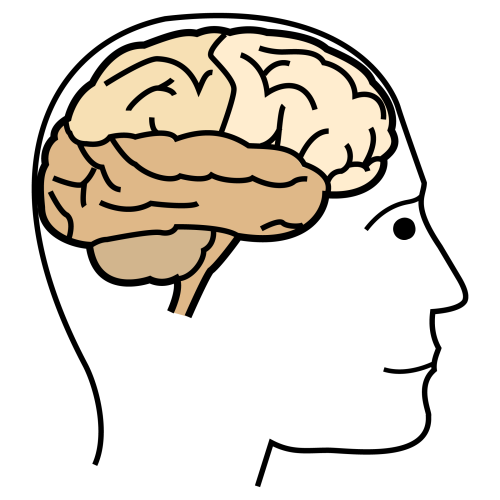

# U5. Epilepsia

Epilepsia significa "sorpresa, sorpender". Pero queremos que en realidad tú seas la persona sorprendida al comprobar, cuando finalices esta unidad, **lo fácil que resulta entender esta condición de salud** que tantos miedos genera, no sólo a los docentes, sino a un grupo extenso de la población.

La epilepsia ha sido considerada durante siglos en la historia como una enfermedad sagrada, y aún queda algún estigma de estos mitos en las personas. Por eso es importante que tomes nota mental de lo que es cierto en esta enfermedad, **para reducir al mínimo tus miedos y conocer la opción más oportuna si en algún momento tienes que actuar ante una crisis epiléptica**, no sólo de un alumno, sino de cualquier persona de la sociedad.

Los niños que tienen epilepsia no condicionan un modelo de escolarización diferente.

https://youtu.be/l-FnHikOukY

**Tu actitud como profesor es fundamental** para la integración del niño con epilepsia en el centro escolar, por lo que estamos convencidos que con la información que te vamos a ofrecer **conseguirás estar capacitado** para entender los aspectos que más te interesan de esta unidad, y lograr los objetivos de la misma, a través de estas **subunidades elementales:**

1.  Qué es una epilepsia y cuáles son sus tipos
2.  Reconocer los síntomas iniciales de una crisis epiléptica
3.  Saber qué hacer si se desencadena una crisis con convulsiones y de ti depende la primera actuación
4.  Cómo poder realizar una convivencia del todo normal en la clase con el niño que tiene epipsia y sus compañeros, para evitar el miedo o el rechazo.

  
Tienes a tu disposición **material multimedia** que te permitirá conocer todo lo que necesitas sobre la epilepsia, y es muy recomendable (hay 6 en total)

 ¿Te animas a que empecemos?

